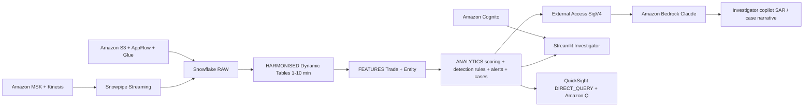

# Digital Asset Market Surveillance & Financial Crime Analytics
### Snowflake + AWS | Demo

> A regulator-friendly, end-to-end financial crime detection platform for crypto exchanges — governed data in Snowflake AI Data Cloud, high-throughput ingestion on AWS, and an investigator copilot powered by Amazon Bedrock.

---

## Two Personas, One Governed Platform

| Persona | Tool | What they see |
|---|---|---|
| **Compliance Investigator** | Streamlit in Snowflake | Cases, alerts, entity profiles, SAR drafts, masked PII |
| **Chief Compliance Officer** | Amazon QuickSight + Amazon Q | Alert trends, risk heatmaps, case SLA, KRIs/KPIs |

---

## Architecture

A digital-asset market surveillance and financial-crime platform built on **Snowflake** (Snowpipe Streaming, Dynamic Tables, Cortex Analyst, External Access) and **AWS** (MSK, Kinesis, S3, AppFlow, Glue, Cognito, Bedrock Claude, QuickSight + Amazon Q). High-throughput trade data lands via MSK / Kinesis; Snowflake produces detection alerts and case features; Bedrock powers the investigator copilot.



## Snowflake Capabilities

| Capability | Implementation |
|-----------|---------------|
| Dynamic Tables | 4 HARMONISED + 2 FEATURES + ALERT_SCORES (7-layer pipeline) |
| Snowpipe Streaming | High-throughput trade ingestion from MSK/Kinesis |
| Cortex Agent | SurveillanceAnalyst + data_to_chart tools |
| Semantic View | Structured analytics over alerts, cases, entities |
| Streamlit | Investigator Copilot: case triage, SAR drafts, entity profiles |
| External Access | SigV4-signed calls to Amazon Bedrock for case narratives |
| Data Governance | Horizon tags, masking policies, row access policies on PII |

## AWS Services

| Service | Role in Demo |
|---------|-------------|
| Amazon MSK / Kinesis | High-throughput trade data ingestion |
| Amazon S3 | Batch data landing via AppFlow and Glue |
| AWS Glue | Data catalog and ETL for reference data |
| Amazon Bedrock | Claude-powered SAR narrative generation |
| Amazon Cognito | User authentication for Streamlit |
| Amazon QuickSight | CCO dashboard: alert trends, risk heatmaps, case SLA |
| Amazon Q | Natural language KRI/KPI analytics for executives |


| Layer | AWS | Snowflake |
|---|---|---|
| **Ingest** | MSK, S3, AppFlow, Glue, Cognito | Snowpipe Streaming, External Stages |
| **Transform** | — | Dynamic Tables (RAW → HARMONISED → FEATURES) |
| **Detect** | — | 6 SQL Detection Rules + XGBoost UDF |
| **Investigate** | Amazon Bedrock (Claude) | Streamlit (Investigator Copilot) |
| **Report** | Amazon QuickSight + Amazon Q | Governed Views (VW_KRIS, VW_QUICKSIGHT_*) |
| **Govern** | IAM, KMS | Horizon (Tags, Masking Policies, Row Access Policies) |

---

## Repository Structure

```
aws-fraud-detection-fintech/
├── snowflake/                        # Snowflake SQL (11 scripts, 00–09)
│   ├── 00_setup.sql                  # DB, schemas, roles, warehouses, QuickSight SVC user
│   ├── 01_integrations.sql           # S3 storage integration, Bedrock External Access
│   ├── 02_raw_tables.sql             # 6 RAW tables (VARIANT schema-on-read)
│   ├── 03_harmonised.sql             # 4 Dynamic Tables + synthetic reference views
│   ├── 03b_marketplace_stub.sql      # Zero-row stub if marketplace data unavailable
│   ├── 04_entity_graph.sql           # Entity/Wallet graph + governance (tags, masking, RAP)
│   ├── 05_features.sql               # TRADE_FEATURES + ENTITY_FEATURES Dynamic Tables
│   ├── 06_analytics.sql              # ML scoring UDF + 6 detection rules + ALERTS
│   ├── 07_cases.sql                  # Cases + lifecycle SPs + QuickSight views + KRI/KPI
│   ├── 08_bedrock.sql                # SP_GENERATE_CASE_NARRATIVE (Bedrock Claude via SigV4)
│   ├── 08b_cortex_narrative.sql      # SP_GENERATE_CASE_NARRATIVE (Cortex fallback)
│   ├── 09_semantic_view.sql          # Cortex Analyst semantic view
│   └── demo_build_all.sql            # Single build orchestrator (SnowSQL !source)
├── scripts/
│   ├── generate_synthetic_data.py    # Synthetic data generator (--quick, --seed-and-refresh)
│   ├── settings.py                   # Configuration (connection, data params, AWS)
│   └── __init__.py
├── streamlit/
│   └── investigator_app.py           # Streamlit in Snowflake — Investigator Copilot
├── quicksight/
│   ├── build_dashboards.py           # QuickSight dataset + dashboard builder
│   └── theme.json                    # Snowflake-branded theme
├── aws/
│   └── architecture.drawio           # Architecture diagram (export to PNG/SVG)
├── demo/
│   ├── demo_runbook.md               # 5–7 min live demo script
│   ├── demo_video_script.md          # 2–3 min recorded demo narrative
│   └── sample_sar_narrative.md       # Bedrock fallback SAR narrative
├── requirements.txt                  # Python dependencies
├── .gitignore
└── README.md
```

> **Note for partners**: AWS infrastructure (MSK, S3, Lambda, QuickSight) is built separately by the partner team. This repo contains only the Snowflake platform, Streamlit app, and demo materials.

---

## Quick Start

### Prerequisites
- SnowSQL connected to your Snowflake account (`snowsql -c <CONNECTION>`)
- Python 3.10+ (for synthetic data generator)
- AWS CLI (for QuickSight setup — partner-led)

### 1. Build Snowflake Platform
```bash
snowsql -c <CONNECTION> -f snowflake/demo_build_all.sql
```

### 2. Load Data + Activate Pipeline

**Quick reset** (<60 seconds, 5K trades):
```bash
SNOWFLAKE_CONNECTION_NAME=<CONNECTION> python scripts/generate_synthetic_data.py --quick
```

**Full dataset** (~3 min, 50K trades):
```bash
SNOWFLAKE_CONNECTION_NAME=<CONNECTION> python scripts/generate_synthetic_data.py \
    --scenario all --trades 50000 --seed-and-refresh
```

The `--seed-and-refresh` flag refreshes all Dynamic Tables, runs detection + case creation SPs, resumes tasks, and prints a health check.

### 3. (Optional) Update Bedrock Credentials
```sql
ALTER SECRET CRYPTO_SURVEILLANCE.ANALYTICS.BEDROCK_SECRET
    SET SECRET_STRING = '{"aws_access_key_id":"AKIA...","aws_secret_access_key":"..."}';
```

### 4. Health Check
```sql
SELECT
    (SELECT COUNT(*) FROM CRYPTO_SURVEILLANCE.RAW.CEX_TRADES_RAW)     AS raw_trades,
    (SELECT COUNT(*) FROM CRYPTO_SURVEILLANCE.HARMONISED.TRADES)      AS harm_trades,
    (SELECT COUNT(*) FROM CRYPTO_SURVEILLANCE.HARMONISED.ENTITY)      AS entities,
    (SELECT COUNT(*) FROM CRYPTO_SURVEILLANCE.ANALYTICS.ALERTS)       AS alerts,
    (SELECT COUNT(*) FROM CRYPTO_SURVEILLANCE.ANALYTICS.CASES)        AS cases;
```

Expected: raw_trades ~5K (quick) or ~50K (full), alerts > 50, cases > 5.

---

## SQL File Map

| # | File | What it creates |
|---|---|---|
| 00 | `00_setup.sql` | DB, 5 schemas, 4 roles, 2 warehouses, QuickSight SVC user (network policy commented — see notes) |
| 01 | `01_integrations.sql` | S3 storage integration, Bedrock External Access, streaming user |
| 02 | `02_raw_tables.sql` | 6 RAW tables (VARIANT schema-on-read) |
| 03 | `03_harmonised.sql` | 4 Dynamic Tables + synthetic price/wallet/marketplace views |
| 04 | `04_entity_graph.sql` | ENTITY, WALLET, ENTITY_RELATION + governance (tags, masking, RAP) |
| 05 | `05_features.sql` | TRADE_FEATURES + ENTITY_FEATURES Dynamic Tables |
| 06 | `06_analytics.sql` | ML scoring UDF (XGBoost heuristic*) + ALERT_SCORES DT + 6 detection rules + ALERTS |
| 07 | `07_cases.sql` | CASES + case lifecycle SPs + QuickSight views + KRI/KPI views |
| 08 | `08_bedrock.sql` | SP_GENERATE_CASE_NARRATIVE (Bedrock Claude via SigV4) |
| 08b | `08b_cortex_narrative.sql` | SP_GENERATE_CASE_NARRATIVE (Cortex fallback — no AWS required) |
| 09 | `09_semantic_view.sql` | Cortex Analyst semantic view for natural-language queries |

> *The XGBoost UDF (`FRAUD_RISK_SCORE`) uses a heuristic scoring formula for demo portability. Replace with a trained model via `_cache['model']` for production use.

---

## Demo Scripts

| Script | Duration | Audience |
|---|---|---|
| `demo/demo_video_script.md` | 2–3 min | Recorded video walkthrough |
| `demo/demo_runbook.md` | 5–7 min | Live booth demo |

---

## Legal

Licensed under the Apache License, Version 2.0. See [LICENSE](LICENSE).

This is a personal project and is **not an official Snowflake offering**. It comes with **no support or warranty**. Use it at your own risk. Snowflake has no obligation to maintain, update, or support this code. Do not use this code in production without thorough review and testing.
