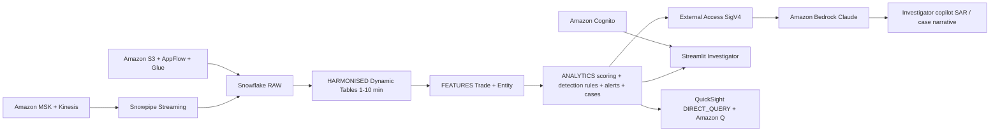

# Digital Asset Market Surveillance & Financial Crime Analytics

End-to-end financial crime detection platform for crypto exchanges — governed data in Snowflake AI Data Cloud, high-throughput ingestion on AWS, and an investigator copilot powered by Amazon Bedrock.

## Architecture

A digital-asset market surveillance and financial-crime platform built on **Snowflake** (Snowpipe Streaming, Dynamic Tables, Cortex Analyst, External Access) and **AWS** (MSK, Kinesis, S3, AppFlow, Glue, Cognito, Bedrock Claude, QuickSight + Amazon Q). High-throughput trade data lands via MSK / Kinesis; Snowflake produces detection alerts and case features; Bedrock powers the investigator copilot.



## Snowflake Capabilities

| Capability | Implementation |
|-----------|---------------|
| Dynamic Tables | 4 HARMONISED + 2 FEATURES + ALERT_SCORES (7-layer pipeline) |
| Snowpipe Streaming | High-throughput trade ingestion from MSK/Kinesis |
| Cortex Agent | SurveillanceAnalyst + data_to_chart tools |
| Semantic View | Structured analytics over alerts, cases, entities |
| Streamlit | Investigator Copilot: case triage, SAR drafts, entity profiles |
| External Access | SigV4-signed calls to Amazon Bedrock for case narratives |
| Data Governance | Horizon tags, masking policies, row access policies on PII |

## AWS Services

| Service | Role in Demo |
|---------|-------------|
| Amazon MSK / Kinesis | High-throughput trade data ingestion |
| Amazon S3 | Batch data landing via AppFlow and Glue |
| AWS Glue | Data catalog and ETL for reference data |
| Amazon Bedrock | Claude-powered SAR narrative generation |
| Amazon Cognito | User authentication for Streamlit |
| Amazon QuickSight | CCO dashboard: alert trends, risk heatmaps, case SLA |
| Amazon Q | Natural language KRI/KPI analytics for executives |

## Personas

| Persona | Role | Key Questions |
|---------|------|---------------|
| **Compliance Investigator** | Day-to-day case triage and SAR drafting | "Show me high-risk entities." "Generate a SAR narrative for this case." |
| **Chief Compliance Officer** | Strategic risk oversight and KRI/KPI monitoring | "What's our alert-to-case conversion rate?" "Which detection rules are firing most?" |

## Data

| Table | Rows | Description |
|-------|------|-------------|
| CEX_TRADES_RAW | 50,000 | Raw exchange trades (VARIANT schema-on-read) |
| ORDERS_RAW | 10,000 | Order book snapshots |
| BALANCES_RAW | 5,000 | Account balance snapshots |
| LOGS_RAW | 5,000 | Platform activity logs |
| ONCHAIN_EVENTS_RAW | 5,000 | On-chain transaction events |
| ENTITY | 50 | KYC-verified entities with risk ratings |
| WALLET | 170 | Wallet addresses linked to entities |
| ALERTS | 733 | Detection rule outputs |
| CASES | 84 | Investigation cases with lifecycle |

## Build Instructions

### Prerequisites
- Snowflake account with ACCOUNTADMIN access
- Cortex AI enabled (Cortex Analyst, Cortex Agent)
- Warehouse: CORTEX (Medium)
- Python 3.10+ (for synthetic data generator)
- AWS CLI (for QuickSight setup)

### Deployment

```bash
snowsql -c <CONNECTION> -f snowflake/demo_build_all.sql

SNOWFLAKE_CONNECTION_NAME=<CONNECTION> python scripts/generate_synthetic_data.py --quick
```

### Streamlit App
```
CRYPTO_SURVEILLANCE.ANALYTICS.INVESTIGATOR_COPILOT
```

## Build Modes

### Snowflake Only
Run the SQL scripts in `snowflake/` (skip `01_integrations.sql`, use `08b_cortex_narrative.sql` instead of `08_bedrock.sql`) and deploy the Streamlit app from `streamlit/deploy/`. Uses Cortex AI instead of Bedrock, and Snowflake Intelligence instead of QuickSight.

### Full AWS + Snowflake
Run all SQL scripts including `01_integrations.sql` and `08_bedrock.sql`, deploy the main Streamlit app from `streamlit/`, then run the QuickSight setup from `quicksight/`.

## Business Impact

Industry research and Snowflake customer outcomes:
- **Traditional transaction monitoring**: 95% false positive rate -- Industry benchmark
- **AI reduces investigation time** per case by 50-70% -- McKinsey Financial Crimes
- **FIS** (Snowflake customer): 2.5x faster execution, 33% cost savings, processes 1B transactions without issue -- [snowflake.com/customers/fis](https://www.snowflake.com/en/customers/all-customers/case-study/fis/)
- **2023 crypto enforcement actions**: $5.6B in fines globally -- Chainalysis

- **FIS** processes 1 billion compliance transactions on Snowflake with 68% fewer severity-1 incidents -- [snowflake.com/customers/fis](https://www.snowflake.com/en/customers/all-customers/case-study/fis/)

## Key Demo Numbers

- **733 alerts** generated by 6 detection rules (pump-and-dump, wash trading, cross-exchange arb, sanctions, structuring, mixer)
- **84 active cases** with full lifecycle (OPEN → INVESTIGATING → ESCALATED → CLOSED)
- **50 entities** with KYC tiers, PEP/sanctions flags, and AML risk ratings
- **XGBoost fraud scoring** UDF produces per-entity ML probability
- **Bedrock Claude** generates SAR narratives in seconds

## License

Apache 2.0 — See [LICENSE](LICENSE) for details.

This is a personal demo project and is not an official Snowflake offering. It comes with no support or warranty. Industry metrics cited are from publicly available third-party research and Snowflake customer stories; they represent reported outcomes and are not guarantees of results.
