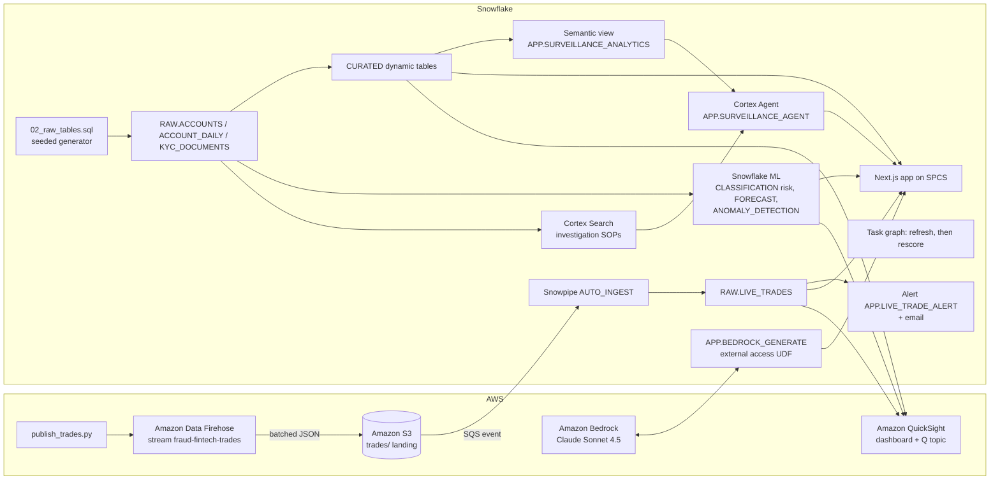

# APJ Digital Asset Exchange - Market Surveillance and Financial Crime

End-to-end trade surveillance for **40 accounts on a fictional digital-asset exchange across 5 APJ markets** (Singapore, Hong Kong, Sydney, Tokyo, Seoul) using Snowflake, optionally with AWS: from a live trade alert to a 7-day suspicious-activity risk score, an alert email and an AI action memo for the compliance team.

## Architecture

A market-surveillance pipeline built on **Snowflake** (Dynamic Tables, Snowflake ML, Cortex Search, Cortex Agent, Cortex AI_COMPLETE, SPCS) and, in the full build, **AWS** (Amazon Data Firehose, S3, Bedrock Claude, QuickSight + Amazon Q). Trade events land in `RAW.LIVE_TRADES`. Dynamic tables curate 90 days of account-day history: alerts raised, confirmed suspicious alerts, SARs filed, alert precision and periodic review compliance. Snowflake ML scores 7-day suspicious-activity risk per account, forecasts exchange-wide alert volume and flags self-match ratio anomalies. A Cortex Agent answers questions with SOP citations, and an LLM drafts the compliance action memo.

Interactive diagrams (hover for object names): [Snowflake only](docs/architecture-snowflake.html) | [AWS + Snowflake](docs/architecture-aws.html). The app shows both on its Architecture & Data tab, the current build first. Regenerate them with `python3 docs/build_architecture.py`.


```mermaid
flowchart LR
    subgraph AWS
      SIM[publish_trades.py] --> FH[Amazon Data Firehose<br/>stream fraud-fintech-trades]
      FH -->|batched JSON| S3[(Amazon S3<br/>trades/ landing)]
      BR[Amazon Bedrock<br/>Claude Sonnet 4.5]
      QS[Amazon QuickSight<br/>dashboard + Q topic]
    end
    subgraph Snowflake
      S3 -->|SQS event| PIPE[Snowpipe AUTO_INGEST] --> LIVE[RAW.LIVE_TRADES]
      GEN[02_raw_tables.sql<br/>seeded generator] --> RAW[RAW.ACCOUNTS / ACCOUNT_DAILY / KYC_DOCUMENTS]
      RAW --> DT[CURATED dynamic tables]
      RAW --> ML[Snowflake ML<br/>CLASSIFICATION risk, FORECAST,<br/>ANOMALY_DETECTION]
      DT --> SV[Semantic view<br/>APP.SURVEILLANCE_ANALYTICS]
      RAW --> CS[Cortex Search<br/>investigation SOPs]
      SV --> AG[Cortex Agent<br/>APP.SURVEILLANCE_AGENT]
      CS --> AG
      LIVE --> AL[Alert APP.LIVE_TRADE_ALERT<br/>+ email]
      UDF[APP.BEDROCK_GENERATE<br/>external access UDF]
      TK[Task graph: refresh, then rescore]
      APP[Next.js app on SPCS]
    end
    BR <--> UDF
    DT --> APP
    ML --> APP
    LIVE --> APP
    AG --> APP
    UDF --> APP
    DT --> QS
    ML --> QS
    LIVE --> QS
```

The Snowflake-only build drops the AWS subgraph: `APP.SIMULATE_TRADES` writes to `RAW.LIVE_TRADES`, and the app calls Cortex `AI_COMPLETE` instead of the Bedrock UDF.

## Snowflake Capabilities

| Capability | Implementation |
|-----------|---------------|
| Dynamic Tables | `CURATED.KPI_SUMMARY`, `PERFORMANCE_SUMMARY`, `RULE_SUMMARY`, `TREND_ANALYSIS` from the RAW tables |
| Snowflake ML | CLASSIFICATION 7-day suspicious-activity risk (`ML.SUSPICION_RISK_SCORES`), 14-day alert-volume FORECAST, self-match ratio ANOMALY_DETECTION |
| Cortex Search | 14 synthetic alert-investigation SOPs (one per account type and detection rule) in `SEARCH.INVESTIGATION_SOP_SEARCH` |
| Semantic View | `APP.SURVEILLANCE_ANALYTICS` over accounts, detection rules, daily totals and risk |
| Cortex Agent | `APP.SURVEILLANCE_AGENT`: Cortex Analyst over the semantic view plus Cortex Search for SOP citations |
| Cortex AI | `AI_COMPLETE('claude-sonnet-4-5')` for grounded answers, and for the action memo in the Snowflake-only build |
| Alerts + Tasks | `APP.LIVE_TRADE_ALERT` logs ALERT events and sends email; task graph `TASK_REFRESH_CURATED`, then `TASK_RESCORE_RISK` |
| Snowpark Container Services | Next.js app `APP.FRAUD_FINTECH_APP` with 6 tabs: Executive Cockpit, Predictive, Account Review, Live Trades, Ask AI, Architecture & Data |
| Snowpipe | `RAW.LIVE_TRADES_PIPE` AUTO_INGEST from S3 (AWS build only) |

## AWS Services

Used only in the AWS + Snowflake build.

| Service | Role in Demo |
|---------|-------------|
| Amazon Data Firehose | Direct PUT stream `fraud-fintech-trades` receives simulated trade events and writes batches to S3 |
| Amazon S3 | Landing bucket (`trades/`). An event notification goes to the Snowpipe SQS queue |
| Amazon Bedrock | Claude Sonnet 4.5 writes the action memo, called from Snowflake through an external-access UDF |
| Amazon QuickSight | DIRECT_QUERY executive dashboard over Snowflake (daily alerts, confirmed alerts by account, suspicious-activity risk) |
| Amazon Q | Natural-language questions over the QuickSight topic `fraud-fintech-topic` |
| AWS IAM | Least-privilege roles for S3, Firehose and Bedrock |

## Personas

These personas are fictional.

| Persona | Role | Key Questions |
|---------|------|---------------|
| **Grace Lim** | Chief Compliance Officer | "What is our alert precision?" "Which detection rules produce the most confirmed suspicious activity?" |
| **Daniel Wong** | Financial Crime Investigator | "Which accounts are high risk this week, and which SOP applies?" |

## Data

All data is synthetic and seeded, so every rebuild reproduces it. The exchange, accounts and names are fictional.

| Table | Rows | Description |
|-------|------|-------------|
| RAW.ACCOUNTS | 40 | Exchange accounts across 5 markets and 5 account types (Retail, VIP, Market Maker, Institutional, OTC Desk), with KYC tier |
| RAW.ACCOUNT_DAILY | 3,600 | Daily account observations over 90 days: trades, notional (USD), alerts, confirmed alerts, SARs, detection rule, periodic review, self-match and cancel ratios |
| RAW.KYC_DOCUMENTS | 40 | Required, on-file and pending KYC documents per account |
| SEARCH.INVESTIGATION_DOCS | 14 | Synthetic alert-investigation SOPs indexed for Cortex Search |
| RAW.LIVE_TRADES | Grows during the demo | Live trade events from Firehose (AWS build) or `APP.SIMULATE_TRADES` (Snowflake-only build) |
| ML.SUSPICION_RISK_SCORES | 40 | 7-day suspicious-activity probability and risk band per account |

## Build Instructions

### Prerequisites
- Snowflake account with ACCOUNTADMIN access, and Cortex AI enabled (AI_COMPLETE, Search, Agent).
- An X-Small warehouse with auto-suspend at or below 120 s, and an existing SPCS compute pool.
- Python 3.11+, `snowflake-connector-python`, Node.js 22+, Docker and the `snow` CLI.
- App image: run `snow spcs image-registry login`, then build and push `fraud-fintech-app:v1` to the database's `APP.IMAGES` repository (see the header of `snowflake/07_deploy_app.sql`).
- AWS build only: `boto3`, AWS credentials for the target account (us-west-2) with Bedrock access, and QuickSight Enterprise.

### SPCS App
```
<DATABASE>.APP.FRAUD_FINTECH_APP
```

### Tests
```bash
python -m pytest aws snowflake quicksight
```

For a local run, put `SNOWFLAKE_ACCOUNT`, `SNOWFLAKE_USER`, `SNOWFLAKE_DATABASE`, `SNOWFLAKE_WAREHOUSE`, `SNOWFLAKE_AUTHENTICATOR=PROGRAMMATIC_ACCESS_TOKEN`, `SNOWFLAKE_TOKEN` and `DEMO_PLATFORM` in the environment, then run `npm --prefix app run build && npm --prefix app start`.

## Build Modes

Both modes share the same core. They differ in three places, and the app's `DEMO_PLATFORM` setting (in its SPCS spec) switches the memo provider and the Live Trades tab.

| Layer | Snowflake Only | Full AWS + Snowflake |
|---|---|---|
| Live trades | `CALL APP.SIMULATE_TRADES(n)` inserts simulated trade events into `RAW.LIVE_TRADES`. This simulates a trade feed; it is not Snowpipe Streaming | `aws/publish_trades.py` to Amazon Data Firehose, then S3, SQS and Snowpipe AUTO_INGEST |
| Action memo | Cortex `AI_COMPLETE('claude-sonnet-4-5')` | Amazon Bedrock Claude Sonnet 4.5 through `APP.BEDROCK_GENERATE` |
| BI and natural-language questions | The SPCS app is the dashboard; questions go to the Cortex Agent | Also a QuickSight dashboard and an Amazon Q topic |
| App setting | `DEMO_PLATFORM: snowflake` | `DEMO_PLATFORM: aws` |

### Snowflake Only

```bash
# 1. Core data and dynamic tables (guarded: new isolated database only)
python snowflake/run_core.py --database FRAUD_FINTECH_SNOWFLAKE --warehouse <XS_WAREHOUSE> --connection <CONNECTION> --apply
# 2. Native trade feed, ML, search, semantic view, agent, alert and task graph
python snowflake/run_intelligence.py --database FRAUD_FINTECH_SNOWFLAKE --platform snowflake --warehouse <XS_WAREHOUSE> --connection <CONNECTION> --alert-email you@example.com
# 3. App on SPCS with DEMO_PLATFORM=snowflake (push the image first)
python snowflake/run_intelligence.py --database FRAUD_FINTECH_SNOWFLAKE --platform snowflake --warehouse <XS_WAREHOUSE> --connection <CONNECTION> --alert-email you@example.com --files 07_deploy_app.sql --compute-pool <COMPUTE_POOL>
```

During the demo:
- Run `CALL APP.SIMULATE_TRADES(20)` to add live trade events. For a continuous feed, run `ALTER TASK APP.TASK_SIMULATE_TRADES RESUME`, and `SUSPEND` it afterwards.
- Run `EXECUTE ALERT APP.LIVE_TRADE_ALERT` to raise the alert email.
- Run `EXECUTE TASK APP.TASK_REFRESH_CURATED` to refresh the curated tables and rescore risk.

Afterwards, drop the database or run `ALTER SERVICE APP.FRAUD_FINTECH_APP SUSPEND`.

### Full AWS + Snowflake

```bash
# 1. Core data and dynamic tables (guarded: new isolated database only)
python snowflake/run_core.py --database FRAUD_FINTECH_AWS --warehouse <XS_WAREHOUSE> --connection <CONNECTION> --apply
# 2. AWS ingestion and Bedrock (dry run first, then --apply)
python aws/setup_aws.py --database FRAUD_FINTECH_AWS --account <AWS_ACCOUNT_ID> --connection <CONNECTION> --apply
# 3. ML, search, semantic view, agent, alert and task graph
python snowflake/run_intelligence.py --database FRAUD_FINTECH_AWS --platform aws --warehouse <XS_WAREHOUSE> --connection <CONNECTION> --alert-email you@example.com
# 4. App on SPCS with DEMO_PLATFORM=aws (push the image first)
python snowflake/run_intelligence.py --database FRAUD_FINTECH_AWS --platform aws --warehouse <XS_WAREHOUSE> --connection <CONNECTION> --alert-email you@example.com --files 07_deploy_app.sql --compute-pool <COMPUTE_POOL>
# 5. QuickSight dashboard and Q topic (needs an existing Snowflake data source)
python quicksight/build_dashboards.py --database FRAUD_FINTECH_AWS --account <AWS_ACCOUNT_ID> --principal-arn <QUICKSIGHT_USER_ARN> --data-source-arn <DATA_SOURCE_ARN> --prefix fraud-fintech --apply --update --with-topic
```

QuickSight objects must be shared with the QuickSight user who signs in (`--principal-arn`); otherwise the console shows nothing.

During the demo:
- Run `python aws/publish_trades.py --count 20` to send live trade events. Firehose buffers for up to 60 seconds before writing to S3.
- Run `EXECUTE ALERT APP.LIVE_TRADE_ALERT` to raise the alert email.
- Run `EXECUTE TASK APP.TASK_REFRESH_CURATED` to refresh the curated tables and rescore risk.

Afterwards, `python aws/teardown_aws.py --database FRAUD_FINTECH_AWS --account <AWS_ACCOUNT_ID> --connection <CONNECTION> --apply` removes the AWS resources and the account-level Bedrock external-access and S3 storage integrations. It leaves the email integration `FRAUD_FINTECH_EMAIL_INT`, which the Snowflake-only build also uses.

## Business Impact

Industry research and Snowflake customer outcomes:
- **Illicit crypto addresses** received $40.9 billion in 2024 by the addresses identified at publication, with the total estimated to be closer to $51 billion; stablecoins made up 63% of all illicit transaction volume -- [Chainalysis, 2025 Crypto Crime Trends](https://www.chainalysis.com/blog/2025-crypto-crime-report-introduction/)
- **FIS** (Snowflake customer) rebuilt its capital markets Compliance Suite, which covers surveillance, anti-money laundering and regulatory reporting, on Snowflake: 2.5x faster execution, 33% cost savings from licenses, maintenance and overhead, and "up to a billion transactions without issue" -- [Snowflake customer story: FIS](https://www.snowflake.com/en/customers/all-customers/case-study/fis/)

## Key Demo Numbers

These figures are synthetic and come from the seeded demo data. Forecast and anomaly figures can shift slightly with the build day.

- **40 accounts**, 3,600 account-days over 90 days, across 5 markets and 5 account types; USD 14,455 M notional monitored
- **584 alerts** raised and **208 confirmed** as suspicious, so alert precision is 35.6%; **101 SARs** filed
- **Structuring** produces the most confirmed alerts (56 of 147); the 16 market volatility spike alerts are never confirmed
- **Suspicious-activity model** out-of-time holdout: precision 0.40, recall 0.38 at a 0.5 threshold, against a 0.21 base rate. Nine accounts are high risk; the top account is ACC-0013, at 97.1%
- **14-day alert forecast** with prediction intervals; **48 of 640** account-days flagged as self-match ratio anomalies
- **Account review compliance 78.5%**, KYC document coverage 65.3%, with 23 documents pending
- **14 SOPs** indexed for Cortex Search and cited by ID in agent answers

## License

Apache 2.0 — See [LICENSE](LICENSE) for details.

This is a personal demo project and is not an official Snowflake offering. It comes with no support or warranty. Industry metrics cited are from publicly available third-party research and Snowflake customer stories; they represent reported outcomes and are not guarantees of results.
